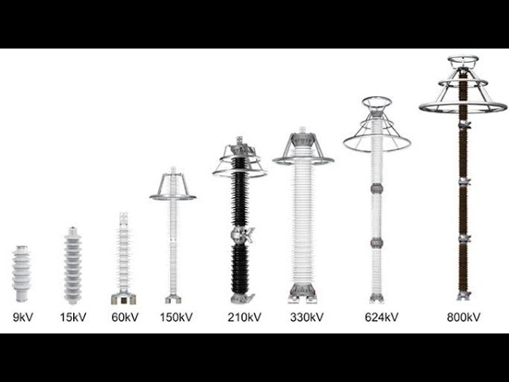

# ⚡ معدات ساحة المفاتيح (Switchyard Components)

يوثق هذا القسم الترتيب الهندسي الفعلي لمهمات "خلية الخط" (Line Bay) في محطة محولات جرجا 220 كيلوفولت، بدءاً من دخول خط النقل الهوائي إلى المحطة وحتى الوصول إلى القضبان العمومية (`Busbars`).

---

### 1. مانع الصواعق (Surge Arrester)
هو خط الدفاع الأول للمحطة ويركب في بداية دخول الخط الجوي.
* **الوظيفة الأساسية:** حماية معدات المحطة من الارتفاعات المفاجئة والخطيرة في الجهد (`Overvoltages`) الناتجة عن الصواعق الرعدية أو عمليات الفصل والتوصيل.
* **آلية العمل:** يعمل كمسار بديل لتفريغ هذه الشحنات العالية جداً إلى شبكة الأرضي، مما يحمي العوازل والمحولات من الانهيار.

*()*

---

### 2. محول الجهد (Voltage Transformer - VT / PT)
جهاز يقوم بأخذ عينة مصغرة من الجهد العالي وتخفيضها إلى قيم آمنة (غالباً 100 أو 110 فولت).
* **سبب التسمية:** يُعرف بـ `VT` (حسب مواصفات IEC) أو `PT` (حسب مواصفات ANSI/IEEE)، وكلاهما يشير لنفس المعدة.
* **الوظيفة:** إعطاء قراءات الجهد لأجهزة القياس (العدادات) ولأجهزة الوقاية (`Protection Relays`).
* **طريقة التوصيل:** يُوصل دائماً بـ **التوازي** مع الشبكة.

---

### 3. سكينة الأرضي (Earthing Switch)
معدة ميكانيكية حيوية لضمان سلامة طاقم الصيانة.
* **الوظيفة:** عند فصل الدائرة لغرض الصيانة، تظل هناك شحنات سعوية محتجزة (`Trapped charges`) أو جهود مستحثة. يتم غلق سكينة الأرضي لتفريغ هذه الشحنات بالكامل إلى الأرض.

---

### 4. سكينة الخط (Line Disconnector / Isolator)
مفتاح ميكانيكي يُستخدم لفصل وتوصيل الدائرة ميكانيكياً.
* **الوظيفة:** إحداث "فصل مرئي ومادي" (`Visible Isolation`) للتأكد بالعين المجردة من أن الدائرة مفصولة قبل بدء أعمال الصيانة.
* **قاعدة تشغيلية هامة:** السكينة لا يمكنها فصل أو توصيل التيار تحت الحمل (`Off-load device`). يجب فتح قاطع التيار (`Circuit Breaker`) أولاً لوقف مرور التيار، ثم تُفتح السكينة.

---

### 5. محول التيار (Current Transformer - CT)
يقوم بتخفيض قيم التيارات العالية في الشبكة إلى تيارات صغيرة ومقننة (1 أمبير أو 5 أمبير).
* **التصميم في جهد 220 ك.ف:** يحتوي على عدة قلوب (`Multi-Core`)، بعضها مخصص للقياس الدقيق (`Metering Cores`)، وبعضها مخصص للوقاية (`Protection Cores`) ليتحمل تيارات القصر العالية دون تشبع.
* **طريقة التوصيل:** يُوصل دائماً بـ **التوالي** مع الخط.
* **قاعدة السلامة الذهبية:** يُمنع منعاً باتاً فتح دائرة الملف الثانوي (`Open Circuit`) لمحول التيار أثناء مرور تيار في الملف الابتدائي، لأن ذلك يولد جهداً عكسياً هائلاً يؤدي إلى انفجار المعدة فوراً.

