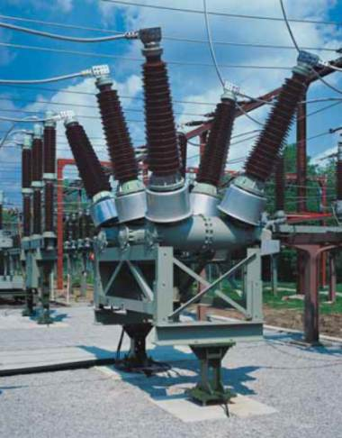

# ⚡ قواطع التيار (Circuit Breakers)

يوثق هذا القسم أنواع قواطع التيار ذات الجهد العالي (220 كيلوفولت) التي تم دراستها في ساحة المحطة، مع التركيز على التصميم الميكانيكي، نظرية إخماد الشرارة، وقراءة لوحات البيانات الفنية.

---

### 1. تقنية إخماد الشرارة بغاز (SF6)
تعتمد القواطع الحديثة في محطات النقل على غاز سداسي فلوريد الكبريت (`SF6`) كوسط عازل ومخمد للشرارة.
* **الكفاءة:** الغاز خامل، غير سام، ويمتلك قدرة عزل تبلغ حوالي 3 أضعاف قدرة الهواء، وقدرة على إخماد الشرارة الكهربائية أسرع بـ 100 مرة من الهواء.
* **مستويات مراقبة الغاز:**
  * **الضغط الطبيعي (Filling):** المستوى المثالي للتشغيل.
  * **مرحلة الإنذار (Alarm):** عند حدوث تسريب بسيط ينخفض الضغط، فيرسل القاطع إنذاراً لغرفة التحكم.
  * **مرحلة الحظر (Blocking):** هبوط الضغط لمستوى حرج يمنع القاطع من الفتح أو الغلق ميكانيكياً لتجنب انفجاره.

---

### 2. قواطع الخزان الميت (Dead-Tank Circuit Breaker)
تتميز بأن الغلاف الخارجي المعدني للغرف التي تحوي التلامسات يكون متصلاً بشبكة الأرضي (جهده صفر).
* **التصميم:** 3 أسطوانات معدنية ضخمة (لكل فازة) مضغوطة بالغاز.
* **الأمان:** يمكن لمس الغلاف الخارجي بأمان تام أثناء التشغيل.
* **الميزة:** تدعم خاصية الفصل أحادي القطب (`Single-pole tripping`) لوجود ميكانيزم تشغيل منفصل أسفل كل فازة.

**

---

### 3. قواطع الخزان الحي (Live-Tank Circuit Breaker)
في هذا التصميم، تكون غرف الإخماد (`Interrupter Chambers`) مرفوعة على عوازل خزفية، وغلافها الخارجي يحمل الجهد العالي.
* **استهلاك الغاز:** ينحصر الغاز في الغرف العلوية فقط، مما يجعله يستهلك كمية غاز أقل بكثير من تصميم الخزان الميت (حوالي 19 كجم فقط).
* **آلية التشغيل:** تنتقل الحركة الميكانيكية من صندوق التشغيل السفلي عبر أعمدة عازلة لفتح التلامسات في الأعلى.

**

---

### 4. قراءة لوحة البيانات (Nameplate) 
من خلال فحص لوحات بيانات قواطع (`ABB`) و(`EGEMAC`) في الموقع، تم توثيق أهم المعايير التشغيلية:
* **التيار المقنن (Normal Current):** أقصى تيار يتحمله القاطع بشكل مستمر (تصل إلى `4000A` لرابط القضبان، و `2000A` لخلية الخط).
* **تيار القطع (Short-circuit breaking current):** أقصى تيار عطل يمكن للقاطع فصله بنجاح (مثل `50 kA`).
* **جهد دوائر التحكم (Control Supply Voltage):** تعمل ميكانيزمات الشحن (الزنبرك) ودوائر الفصل والتوصيل بجهد مستمر (`DC 220V`) لضمان عملها حتى عند انقطاع الكهرباء التام (`Blackout`).
* **دورة التشغيل (Operating Sequence):** تسلسل الفتح والغلق الآلي للتعامل مع الأعطال العابرة (`O - 0.3s - CO - 3min - CO`).

