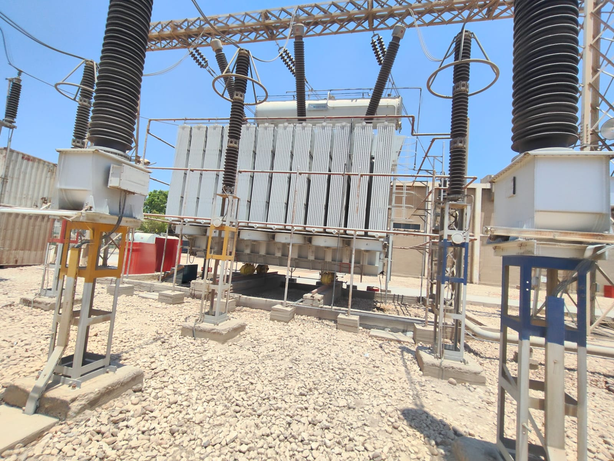

# ⚡ محولات القوى (Power Transformers)

يُعد محول القوى أهم وأغلى معدة داخل المحطة. يوثق هذا القسم التشريح الخارجي للمحولات العملاقة التي تم معاينتها في ساحة محطة جرجا 220 كيلوفولت، والتي تقوم بالربط بين جهود النقل المختلفة (مثل 220/66 كيلوفولت) وتخفيض الجهد بأمان لتغذية الأحمال.

---

### 1. المكونات الظاهرية الأساسية
من خلال الفحص الميداني، يمكن تمييز الأجزاء الرئيسية التالية في التصميم الخارجي للمحول:
* **الخزان الرئيسي (Main Tank):** هو الهيكل المعدني الضخم الذي يحتوي بداخله على القلب الحديدي (`Core`) والملفات (`Windings`). يكون الخزان مغموراً بالكامل بـ "زيت المحولات" الذي يعمل كعازل كهربائي ووسط أساسي للتبريد.
* **زعانف التبريد (Radiators):** ألواح معدنية رأسية متراصة بكثافة على جوانب المحول. عندما يسخن الزيت داخل الخزان، يرتفع ويدخل في هذه الزعانف ليبرد بواسطة الهواء الجوي، ثم يهبط ليعود للخزان في دورة تبريد مستمرة.
* **عوازل الاختراق (Bushings):** الأبراج الخزفية المضلعة البارزة أعلى المحول. وظيفتها تمرير أطراف التوصيل ذات الجهد العالي من خارج المحول إلى الملفات الداخلية بأمان، دون حدوث تفريغ شحنات مع جسم الخزان المعدني.

**

---

### 2. قدرة المحولات (Transformer Capacity)
تُقاس قدرة المحولات الكهربائية بوحدة **الفولت أمبير (VA)** أو مضاعفاتها مثل الميجا فولت أمبير (`MVA`)؛ لأن المحول يتعامل مع "القدرة الظاهرية" (`Apparent Power`) بغض النظر عن طبيعة الحمل.
* **محولات النقل:** المحولات التي تربط بين جهود النقل الفائقة (220/66 ك.ف) تتطلب قدرات ضخمة جداً لاستيعاب طاقة مدن بأكملها (مثل محولات 125 أو 175 ميجا فولت أمبير).
* **التأثير على التصميم:** كلما زادت قدرة المحول، لزم زيادة حجم القلب الحديدي لاستيعاب الفيض المغناطيسي، وزيادة مساحة مقطع النحاس لتحمل التيارات الأعلى، مما يجعل المحولات ذات القدرات الكبيرة أثقل وزناً وتتطلب قواعد خرسانية أضخم.

---

### 3. أنظمة التبريد الملحقة (Cooling Systems)
نظراً لأن المحولات ذات القدرات المرتفعة تولد حرارة مفقودة (`Losses`) أعلى بكثير، تتدرج أنظمة التبريد حسب قدرة المحول:
* **ONAN (Oil Natural Air Natural):** تبريد طبيعي للزيت والهواء، ويُستخدم في الأحمال المنخفضة.
* **ONAF (Oil Natural Air Forced):** عند زيادة الحمل، تعمل مراوح سفلية لدفع الهواء بقوة نحو الزعانف لتسريع تبريد الزيت.
* **OFAF (Oil Forced Air Forced):** في القدرات العملاقة، لا يُكتفى بالمراوح، بل تُستخدم طلمبات إضافية لتدوير الزيت قسرياً داخل الخزان والزعانف لمنع ارتفاع الحرارة.

